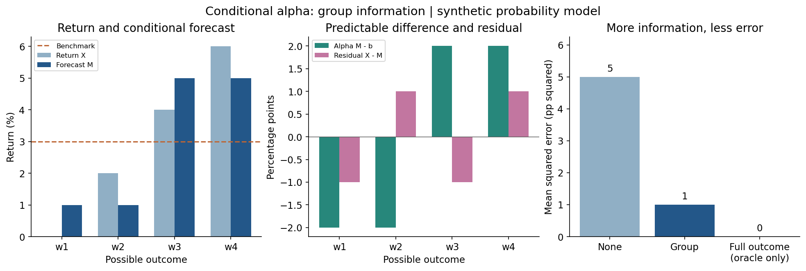

# Chapter 5 · Alpha and conditional expectation

**15-minute experiment · synthetic returns · no market-data subscription needed**

Open [research.ipynb](research.ipynb). Run all cells, change the parameter cell, and rerun.

You can change returns, probabilities, the benchmark forecast, and the information
available to the predictor. The notebook distinguishes conditional alpha from
Jensen's regression alpha and explains the probability space and the role of L².

Expected default output: conditional forecasts **1%, 1%, 5%, 5%**;
alpha **−2, −2, +2, +2 percentage points**; prediction MSE **5 → 1 → 0**
as information increases from none to group to full outcome. Full information is an
oracle comparison, not a trading signal available in advance.

## QuantConnect

[**Run in QuantConnect → Clone this lab**](https://www.quantconnect.com/terminal/clone/36842492/82c8d857c143b927f8b5e3a67e95555f/clone-of%3A-Square-Tan-Dogfish)

1. Sign in to QuantConnect and use the link above to copy the teaching project to your account.
2. Open `research.ipynb` in the copied project, then click **Run All**.
3. If prompted, choose **QuantConnect Research Server Collection → Foundation-Py-Default**.
4. Find the **Parameters** cell. Change `BENCHMARK_PP = 3.0` to `1.0` and run all cells again.

Alpha changes; the conditional forecast and residual stay the same. Try changing the
probabilities and information next. QC cloud execution uses your account's available
Research resources; no paid market dataset is required by this experiment.

[Public QC snapshot and code preview](https://www.quantconnect.cloud/backtest/82c8d857c143b927f8b5e3a67e95555f/?theme=chrome)
also provides a **Clone** button if the direct link is unavailable. The generated project
name may be `clone of Square Tan Dogfish`; you can rename your copy.

To import manually, create a Python project in QuantConnect and upload `research.ipynb`.
Open it in Research and run all cells. The notebook initializes QuantBook in QC;
outside QC it explicitly reports local Python mode.

`main.py` is a no-trade packaging backtest for QC's project-sharing route. Its portfolio
performance is not the result of this experiment. The learning results are in the notebook.

## Verification

Verified on 2026-09-22: local Python 3.12.7 and QC Research Python 3.11.14.
The notebook checks the conditional residual, tower property, orthogonality, and
the MSE decomposition (default: **5 = 4 + 1**). The public snapshot was cloned and
both `main.py` and `research.ipynb` were present in the new project.
Run All in that cloned project also passed the final checks in QC Research.

For local use, install `requirements.txt`, open the notebook in Jupyter, and Run All.
`python validate.py` additionally checks 100 randomized finite probability models.
This is reader prototype 0.1 for the v5.7 Chapter 5 discussion; it is not an official
edition of the manuscript. Use a commit-pinned GitHub URL when linking from a fixed
book edition so future changes do not silently alter the example.

## Preview

